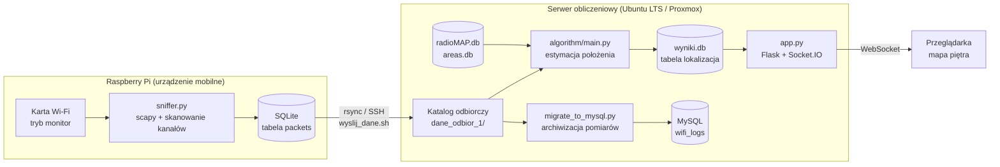
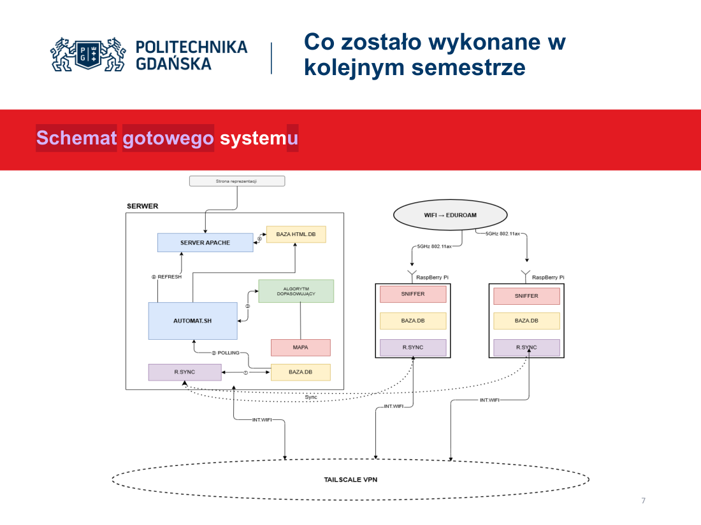
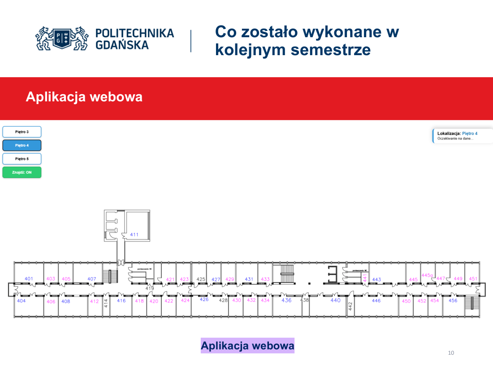
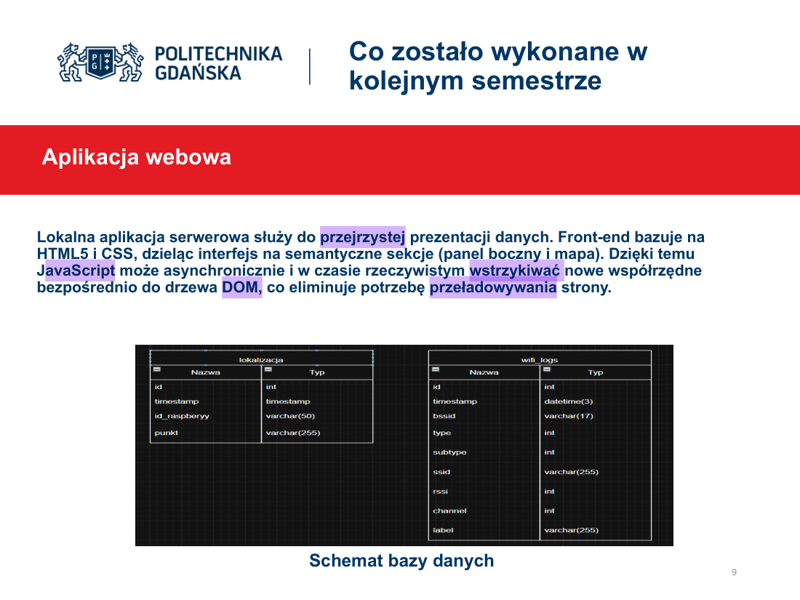
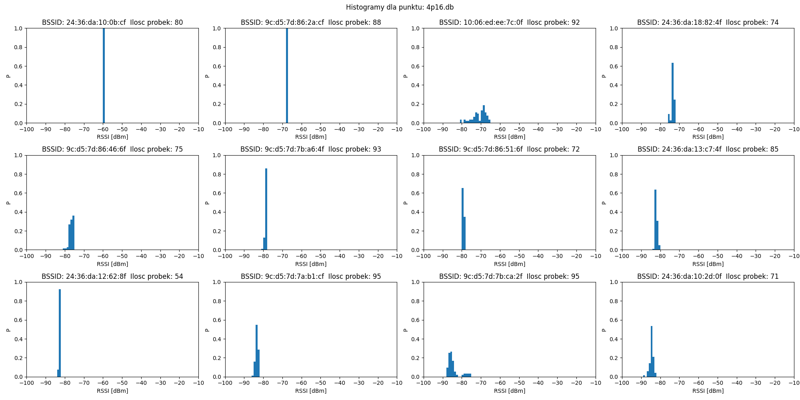
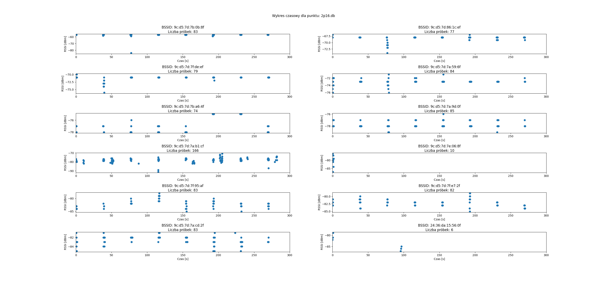
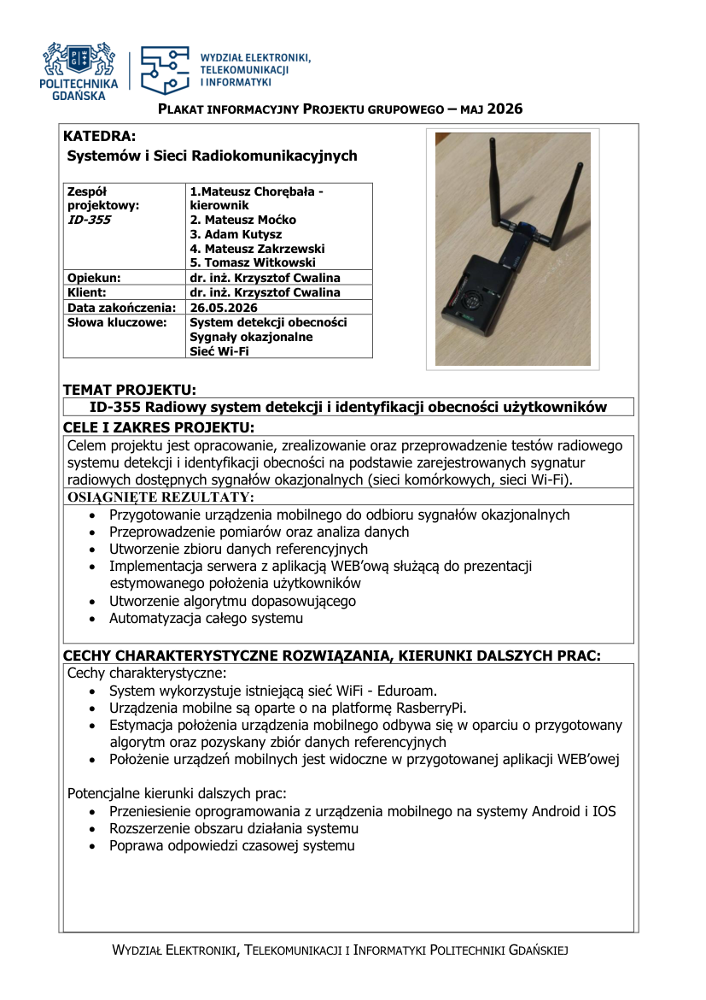

# ID-355 — Radiowy system detekcji i identyfikacji obecności użytkowników

Projekt grupowy · Politechnika Gdańska · Wydział Elektroniki, Telekomunikacji i Informatyki
Katedra Systemów i Sieci Radiokomunikacyjnych · rok akademicki 2025/2026
Opiekun i klient: dr inż. Krzysztof Cwalina

System wyznacza położenie urządzenia wewnątrz budynku na podstawie **sygnatur radiowych sygnałów okazjonalnych Wi-Fi** (metoda *fingerprintingu* RSSI) — bez GPS i bez współpracy ze strony wykrywanego urządzenia.

---

## Spis treści

- [Idea działania](#idea-działania)
- [Architektura systemu](#architektura-systemu)
- [Struktura repozytorium](#struktura-repozytorium)
- [Uruchomienie](#uruchomienie)
- [Algorytm dopasowania](#algorytm-dopasowania)
- [Dane pomiarowe](#dane-pomiarowe)
- [Wyniki i strojenie](#wyniki-i-strojenie)
- [Prezentacja i dokumentacja](#prezentacja-i-dokumentacja)
- [Zespół](#zespół)
- [Bezpieczeństwo](#bezpieczeństwo)

---

## Idea działania

Detekcja obecności opiera się na porównaniu mocy sygnałów okazjonalnych odebranych przez urządzenie mobilne z **wzorcem charakterystycznym dla danego miejsca**, zapisanym wcześniej w bazie danych (radiomapa). Punkt pomiarowy jest następnie dopasowywany do fizycznej lokalizacji przez algorytm dopasowujący.


Zakres projektu obejmował opracowanie, realizację i przetestowanie kompletnego toru: od akwizycji ramek Wi-Fi, przez transport danych i estymację położenia, po prezentację wyniku na mapie piętra w czasie rzeczywistym.

## Architektura systemu





**Platforma serwerowa:** Ubuntu Server LTS jako maszyna wirtualna w środowisku Proxmox 8.3.1, na serwerze fizycznym Dell PowerEdge R420. Urządzenia połączone przez VPN Tailscale.

**Aplikacja webowa:** front-end w HTML5 + CSS podzielony na sekcje semantyczne (panel boczny i mapa). JavaScript asynchronicznie wstrzykuje nowe współrzędne do drzewa DOM przez Socket.IO, dzięki czemu mapa aktualizuje się bez przeładowania strony.

<table>
<tr>
<td></td>
<td></td>
</tr>
</table>

Automatyzacja: pętle w skryptach bash (`automat.sh` po stronie RPi i serwera) zapewniają ciągły strumień przesyłu danych. Każde urządzenie wysyła wraz z paczką danych swój prefiks (`rpi1`, `rpi2`), rozpoznawany przez serwer.

## Struktura repozytorium

```
.
├── raspberry/              Urządzenie mobilne — akwizycja i wysyłka danych
│   ├── sniffer.py            sniffer ramek 802.11 (scapy), zapis do SQLite
│   ├── monitor_mode.sh       przełączenie karty w tryb monitor
│   ├── automat.sh            pętla: pomiar → wysyłka
│   └── wyslij_dane.sh        rsync przez SSH na serwer
│
├── server/                 Serwer obliczeniowy
│   ├── app.py                Flask + Socket.IO, mapa w czasie rzeczywistym
│   ├── templates/index.html  front-end mapy piętra
│   ├── migrate_to_mysql.py   import pomiarów SQLite → MySQL + archiwizacja
│   ├── schema.sql            schemat bazy MySQL
│   └── automat.sh            pętla: algorytm → migracja
│
├── algorithm/              Algorytm estymacji położenia (wersja produkcyjna)
│   ├── main.py               punkt wejścia: main.py <plik.db>
│   ├── chooseBSSID.py        wybór N najsilniejszych BSSID z pomiaru
│   ├── choosePOINTS.py       punkty-kandydaci z radiomapy
│   ├── calculateERROR.py     błąd sumaryczny RSSI dla każdego kandydata
│   ├── chooseCLOSESTpoint.py wybór punktu o najmniejszym błędzie
│   └── sendRESULT.py         zapis wyniku do wyniki.db
│
├── map/                    Przygotowanie radiomapy
│   ├── prepareMap.py         budowa radioMAP.db z pomiarów referencyjnych
│   └── makeAreas.py          budowa areas.db (BSSID widoczne w punkcie)
│
├── analysis/               Analiza pomiarów
│   └── plot_rssi.py          histogramy RSSI i przebiegi czasowe
│
├── experiments/tuning/     Strojenie parametrów N i M (macierz błędów)
│
├── data/
│   ├── reference/            radioMAP.db, areas.db — radiomapa odniesienia
│   ├── sample/               5 przykładowych pomiarów testowych (30 s)
│   └── pomiary/              wyniki kampanii pomiarowych (EA_G2, Soliton_G4)
│
├── docs/                   Dokumentacja projektowa (DPP, DTP, plakat, prezentacja)
└── archiwum/               Wcześniejsze warianty skryptów i podejść
```

## Uruchomienie

### Wymagania

- Python 3.10+
- Raspberry Pi z kartą Wi-Fi obsługującą tryb monitor (użyto **netis WF2190 AC1200**)
- Serwer z MySQL 8 (Ubuntu Server LTS)

```bash
python -m venv .venv && source .venv/bin/activate && pip install -r requirements.txt
```

### Konfiguracja

Wszystkie dane dostępowe pochodzą ze zmiennych środowiskowych — w repozytorium **nie ma i nie może być haseł**.

```bash
cp .env.example .env
```

Uzupełnij `.env`, a następnie skonfiguruj logowanie kluczem SSH (zamiast hasła):

```bash
ssh-copy-id $SERVER_USER@$SERVER_HOST
```

### Raspberry Pi — zbieranie danych

```bash
sudo bash raspberry/monitor_mode.sh
python3 raspberry/sniffer.py --iface wlan0mon --out sniffer/rpi2_$(date +%F_%H-%M-%S).db --duration 11
```

Najważniejsze opcje `sniffer.py`:

| Opcja | Domyślnie | Znaczenie |
|---|---|---|
| `--iface` | `wlx045ea4eeffe9` | interfejs w trybie monitor |
| `--channels` | `1-165` | skanowane kanały (`1,6,11` lub zakres) |
| `--dwell` | `0.25` | czas nasłuchu na kanał [s] |
| `--write-interval` | `2.0` | co ile sekund zapis do bazy |
| `--duration` | `10` | długość pomiaru [s], `0` = bez końca |
| `--out` | — | wyjściowy plik SQLite (wymagane) |

Praca ciągła: `bash raspberry/automat.sh` (pętla pomiar → `wyslij_dane.sh`).

### Serwer — estymacja i prezentacja

```bash
python3 algorithm/main.py /sciezka/do/rpi2_2026-05-20_12-00-00.db   # pojedyncza estymacja
bash server/automat.sh                                              # praca ciągła
python3 server/app.py                                               # mapa: http://<serwer>:5000
```

> **Uwaga:** skrypty w `algorithm/` i `map/` mają jeszcze zaszyte ścieżki `/home/user/algorytm/`
> do plików `radioMAP.db`, `areas.db` i `wyniki.db`. Przy wdrożeniu w innej lokalizacji trzeba je
> podmienić — to znany dług techniczny do sparametryzowania.

## Algorytm dopasowania

Zadaniem algorytmu jest estymacja położenia urządzenia mobilnego przez porównanie RSSI sygnałów o różnych BSSID z danymi referencyjnymi.

1. **`chooseBSSID(plik, N)`** — z pomiaru testowego wybiera **N** BSSID o najwyższej średniej mocy.
2. **`choosePOINTS(bssidy, N)`** — z `areas.db` wyznacza punkty-kandydatów, w których te BSSID w ogóle występują. Brak kandydatów → zwracany jest `"ERR"`.
3. **`calculateERROR(plik, kandydaci, M)`** — dla każdego kandydata liczy błąd sumaryczny RSSI względem radiomapy, biorąc pod uwagę **M** BSSID.
4. **`chooseCLOSESTpoint(kandydaci, błędy)`** — zwraca punkt o najmniejszym błędzie.
5. **`sendRESULT(punkt, id_urządzenia)`** — zapisuje wynik do `wyniki.db` (tabela `lokalizacja`), skąd odczytuje go aplikacja webowa.

Parametry `N` i `M` ustawione są w `algorithm/main.py` (produkcyjnie `N = M = 6`).

### Schemat danych

```sql
-- pomiar z sniffera (SQLite)
packets(timestamp TEXT PK, bssid TEXT, type INT, subtype INT,
        ssid TEXT, rssi FLOAT, channel INT, label TEXT)

-- radiomapa odniesienia
radioMAP(id INTEGER PK, point TEXT, bssid TEXT, rssi DOUBLE)
areas(id INTEGER PK, point TEXT, bssid TEXT)

-- wynik estymacji
lokalizacja(id INTEGER PK, timestamp, id_raspberyy VARCHAR(50), punkt VARCHAR(255))
```

## Dane pomiarowe

| Katalog | Zawartość |
|---|---|
| `data/reference/` | `radioMAP.db` i `areas.db` — po 1190 rekordów radiomapy odniesienia |
| `data/sample/` | 5 pomiarów testowych 30-sekundowych z 4. piętra (`4p01`…`4p17`) |
| `data/pomiary/` | kampanie EA_G2 (22 pomiary), Soliton_G4, pomiar czasowy |

Pełne zbiory pomiarowe (kilkadziesiąt plików `.db`, ~90 MB) nie są wersjonowane w repozytorium — udostępniane są jako załącznik do dokumentacji. Scenariusze pomiarowe i siatki punktów znajdują się w `docs/`.




## Wyniki i strojenie

`experiments/tuning/main.py` uruchamia algorytm dla wszystkich kombinacji `N, M ∈ {1…6}` na zestawie pomiarów testowych i buduje **macierz błędów** — rozkład liczby dopasowań poprawnych oraz odchylonych o 1…10 punktów:

```bash
python experiments/tuning/main.py
```

Wynik pozwolił dobrać parametry pracy algorytmu. Szczegółowe omówienie rezultatów znajduje się w [dokumentacji technicznej](docs/DTP.pdf) i w prezentacji.

## Prezentacja i dokumentacja

| Dokument | Plik |
|---|---|
| Prezentacja końcowa (15 slajdów) | [`docs/prezentacja.pdf`](docs/prezentacja.pdf) |
| Plakat informacyjny | [`docs/plakat.pdf`](docs/plakat.pdf) |
| Deklaracja Projektu (DPP) | [`docs/DPP.pdf`](docs/DPP.pdf) |
| Dokumentacja Techniczna (DTP) | [`docs/DTP.pdf`](docs/DTP.pdf) |
| Scenariusze pomiarowe | [`docs/scenariusz-pomiarowy-grudzien.pdf`](docs/scenariusz-pomiarowy-grudzien.pdf), [`docs/scenariusz-pomiarowy-2026-04-27.pdf`](docs/scenariusz-pomiarowy-2026-04-27.pdf) |
| Siatki punktów pomiarowych | [`docs/EA3-grid.pdf`](docs/EA3-grid.pdf), [`docs/EA4-grid.pdf`](docs/EA4-grid.pdf), [`docs/EA5-grid.pdf`](docs/EA5-grid.pdf), [`docs/punkty-pomiarowe-EA3.pdf`](docs/punkty-pomiarowe-EA3.pdf) |
| Karta katalogowa karty Wi-Fi | [`docs/netis-WF2190-AC1200.pdf`](docs/netis-WF2190-AC1200.pdf) |

<details>
<summary><b>Plakat projektu — podgląd</b></summary>



</details>

## Zespół

| Osoba | Zakres |
|---|---|
| Mateusz Chorębała | kierownik projektu |
| Mateusz Moćko | odbieranie i sniffowanie sygnałów okazjonalnych Wi-Fi |
| Tomasz Witkowski | algorytm dopasowujący — realizacja matematyczna i skryptowa |
| Mateusz Zakrzewski | serwer obliczeniowy, baza danych |
| Adam Kutysz | automatyzacja i integracja systemu |

Opiekun i klient: **dr inż. Krzysztof Cwalina**, Katedra Systemów i Sieci Radiokomunikacyjnych.

## Kierunki dalszych prac

- rozszerzenie systemu o kolejne źródła sygnałów okazjonalnych (np. sieci komórkowe),
- skrócenie czasu reakcji systemu,
- zwiększenie liczby obsługiwanych urządzeń,
- metody akredytacji urządzeń,
- powiększenie obszaru pracy systemu.

## Bezpieczeństwo

- Repozytorium **nie zawiera haseł ani kluczy** — cała konfiguracja wrażliwa pochodzi z pliku `.env`, który jest ignorowany przez gita. Wzorzec: [`.env.example`](.env.example).
- Uwierzytelnianie między urządzeniami odbywa się **kluczami SSH**, nie hasłem w skrypcie.
- Pliki `.db` zawierają adresy BSSID rzeczywistych punktów dostępowych — przed publicznym udostępnieniem kolejnych zbiorów pomiarowych należy rozważyć ich anonimizację.

---

*Projekt zrealizowany w ramach przedmiotu Projekt Grupowy, WETI PG, 2025/2026.*
